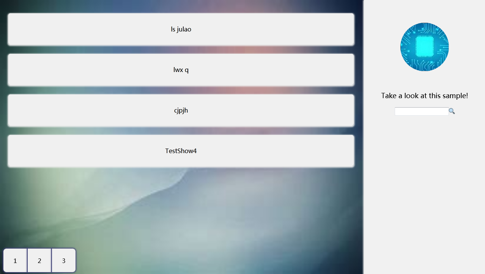
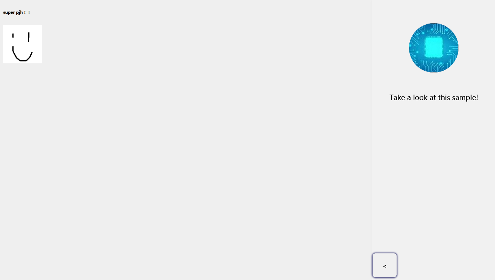

# Hot Blog

###### To create your blog as easy as to take a hot dog!

## Snapshot




## Getting Start

### Step 1. Download

You should [download the source file]() or [fork the repo]() and then take next step.

### Step 2. Configure

Find the `manifest.js` file in the root directory. The format of this file should be like this:

```javascript
let manifest = [
    {
        "title" : /*Your blog's name, string*/,
        "bg" : /*background picture's directory, string*/,
        "avatar" : /*avatar's directory, string*/,
        "owner" : /*owner's name (useless so far), string*/,
        "welcome" : /*text shown in the side bar, string*/,
        "articlePerPage" : /*article shown per page, integer*/,
        "pageNumShow" : /*page shown number, integer*/,
    },
    [
        /*articles*/
    ]
];
```

Now fill the dictionary in manifest[0]. For example like this:

```javascript
{
    "title" : "Hot Blog Sample",
    "bg" : "./img/bg.jpg",
    "avatar" : "./img/avatar.jpg",
    "owner" : "Hotower",
    "welcome" : "Take a look at this sample!",
    "articlePerPage" : 4,
    "pageNumShow" : 5,
}
```

### Step 3. Writing

The array in manifest[1] is for saving articles. An article should be like this:

```javascript
{
    "key" : /*text shown on the main page, string*/,
    "title" : /*title for the article (useless so far), string*/,
    "RDL" : /*RDL to describe the article, in RDL, string*/,
    "tag" : /*tags for the article, array*/
},
```

RDL is a marking language, you can learn more about this at [here](./RDL.md). Here is an example:

```javascript
{
    "key" : "TestShow",
    "title" : "Can you see the article?",
    "RDL" : "h1\\Is Me Show Successfully?\\a\\Hotower on github\\https://github.com/Hotower\\p\\Nice Done!",
    "tag" : ['test','self']
},
```

**Now you have finished all the steps to create a hot blog. If you want to write more passages, just repeat step 3.**
